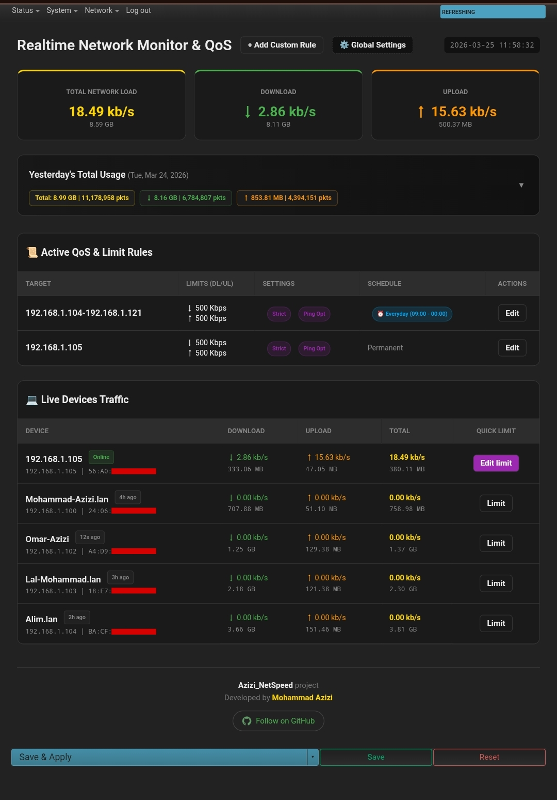
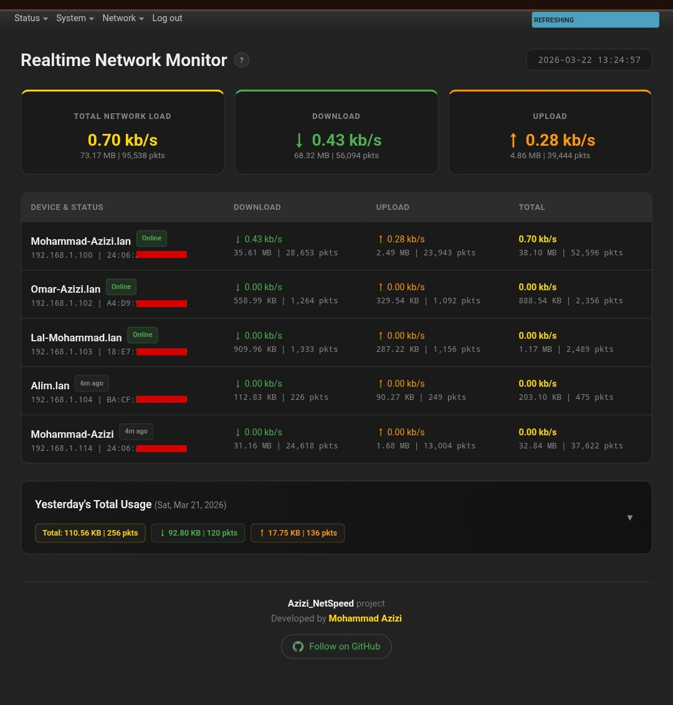
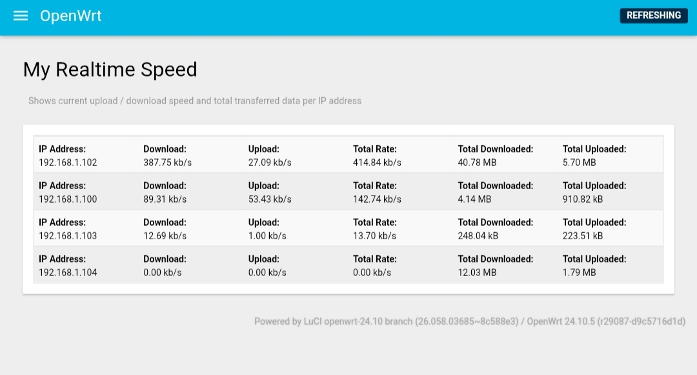

# luci-app-azizi-netspeed

Per-device network speed and bandwidth monitor for OpenWrt


---
Azizi_NetSpeed adds a real-time network monitor to the OpenWrt LuCI interface. It shows per-device upload/download speeds and total data usage using nftables kernel counters, running entirely on the router with minimal overhead.

I built this because I needed something lightweight enough to run on an Archer C50 v6 (8MB flash, single-core MIPS, 64MB RAM) without slowing anything down. Most monitoring tools are way too heavy for that kind of hardware.


## 📸 Screenshots

### 🔹 v3 (Latest)


### 🔹 v2


### 🔹 v2


### 🔹 v1



## Features
- **Live per-device speeds** — see who's downloading what, right now
- **Total usage tracking** — bytes and packet counts per IP, reset daily
- **Online/offline status** — based on actual nftables timeout expiry, not guesswork
- **Yesterday's usage** — collapsible panel showing archived data from the previous day
- **Mobile friendly** — responsive layout, works fine on phone browsers
- **Zero background processes** — no daemons, no polling scripts, everything runs in-kernel

- **Bandwidth Limiting for IPs & Ranges**  
  Limit single devices or entire IP ranges (e.g. `192.168.1.100-192.168.1.150` or `192.168.1.0/24`).

- **Two Limit Modes**  
  - **Strict (DDC)**: Hard cap — device cannot exceed the set speed.  
  - **Shared**: Minimum guaranteed speed + ability to borrow extra bandwidth when the network is idle.

- **Priority System**  
  Set devices or ranges as **High**, **Normal**, or **Low** priority. High priority traffic gets served first during congestion.

- **Low Ping / Gaming Optimization**  
  Enable Cake qdisc with `diffserv4` + `ack-filter` for significantly reduced latency while downloading/uploading.

- **Advanced Scheduling**  
  Set custom time windows (Start Time & End Time) and choose specific days of the week. Rules automatically activate/deactivate.

- **Global Settings Panel**  
  Configure **Max ISP Download/Upload speeds**, **LAN Interface**, and **WAN Interface** directly from the web UI — no more editing scripts.

- **Dedicated QoS Rules Manager**  
  New table showing all active limits, schedules, and priorities with easy Edit/Delete buttons.

- **Reboot Persistence**  
  All settings and rules now survive router reboots automatically.


- **Tiny footprint** — the whole package is under 8KB installed


## How it works

The package integrates with fw4 by adding nftables sets to track per-IP traffic using kernel counters. The LuCI interface reads these counters periodically and calculates real-time speeds without background processes.

A daily cron job saves usage data and resets counters for the next cycle.

Click the "Yesterday's Total Usage" bar to expand the full breakdown. Data is saved automatically at 11:59 PM and counters reset for the new day.


```
┌─────────────┐     nftables sets      ┌──────────────┐
│   Devices    │ ───── forward ──────▶  │  up_per_ip   │
│  on br-lan   │                        │  down_per_ip │
└─────────────┘                         └──────┬───────┘
                                               │
                                    nft -j list set (every 3s)
                                               │
                                        ┌──────▼───────┐
                                        │   LuCI JS    │
                                        │  Dashboard   │
                                        └──────────────┘
```

## Requirements

- OpenWrt 22.03 or later (fw4/nftables-based)
- `luci-base` (comes with any LuCI install)
- `firewall4` and `nftables-json` (standard on modern OpenWrt)

If your router runs OpenWrt with LuCI, you almost certainly have everything you need.

## Installation

### Option A: Web interface

1. Download the latest `.ipk` from the [Releases](https://github.com/Mohammad-Azizi/Azizi_netspeed/releases) page
2. Open your router's admin panel → **System** → **Software**
3. Click **Upload Package**, select the file, and install
4. Refresh the page — "Network Speed" will appear in Status

### Option B: SSH

```bash
# Upload the file to your router first (via scp, sftp, etc.)
cd /tmp
opkg install luci-app-azizi-netspeed_*_all.ipk
```


### Uninstalling

```bash
opkg remove luci-app-azizi-netspeed
```

## Configuration

### Changing the daily reset time

The default reset runs at 11:59 PM. To change it:

1. Go to **System** → **Scheduled Tasks** in LuCI
2. Find the line containing `azizi_netspeed_save`
3. Edit the cron schedule to your preference

```
# Default: run at 11:59 PM every day
59 23 * * * /root/azizi_netspeed_save

# Example: run at 6:00 AM instead
0 6 * * * /root/azizi_netspeed_save
```

## FAQ

**Does this slow down my router?**

No. The nftables counters run inside the kernel's packet processing pipeline — they add virtually zero overhead. The JavaScript frontend only runs when you have the page open in your browser.


**Will I lose today's data if I reboot the router?**

Yes. The live counters are stored in kernel memory (nftables sets) and are cleared on reboot. Yesterday's archived data is saved to `/root/` which survive reboots

**Does this work with VLANs or multiple LANs?**

The default rules track traffic on `br-lan`. If you have additional bridge interfaces, you can add extra rules in `/etc/nftables.d/azizi_monitor.nft` for each interface.

## Contributing

Found a bug? Have an idea? Open an issue or submit a pull request. I'm happy to review contributions of any size.


## Support the project

If this tool is useful to you, the best way to support it is to ⭐ star the repo and share it with other OpenWrt users. That's it — no donations, no subscriptions, just word of mouth.

## License

Apache License 2.0 — see [LICENSE](./LICENSE) for details.

---

Built by [Mohammad Azizi](https://github.com/Mohammad-Azizi) for routers that deserve better monitoring tools.