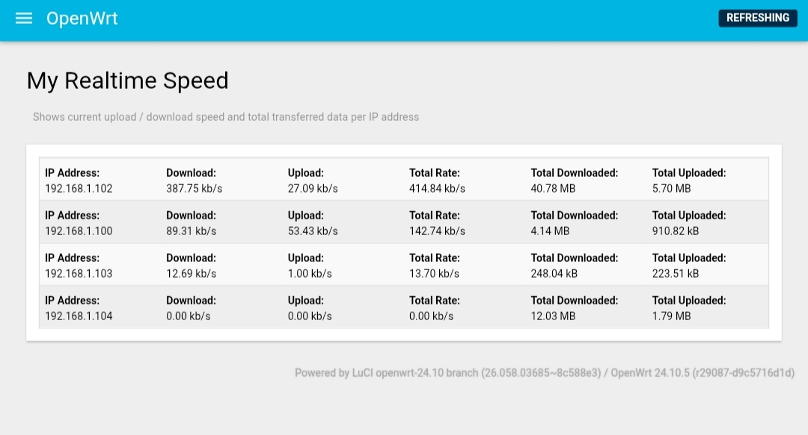
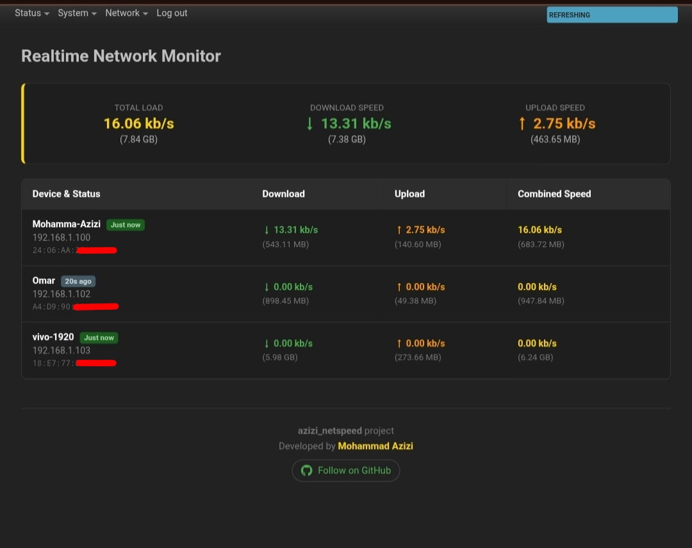
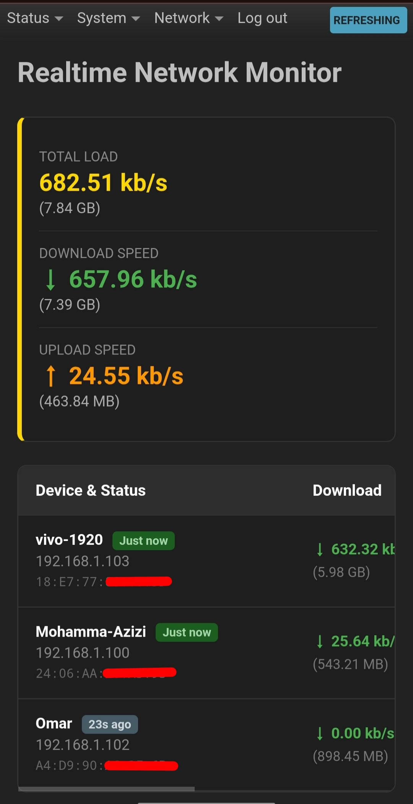

# Azizi NetSpeed – Realtime Per-IP Bandwidth Monitor for OpenWrt

Lightweight realtime upload/download speed monitor per IP address using nftables dynamic counters.  
No extra packages required besides `luci-base`.

## Features
- Shows current speed (kb/s / Mb/s) and total transferred data per client IP
- Automatically detects LAN subnet from UCI (no hard-coded IP)
- Uses nftables dynamic sets → low overhead, auto-cleanup of inactive IPs
- Works on OpenWrt 22.03 / 23.05 / 24.10+
- Pure LuCI integration (appears under Status menu)

## Screenshots

<p align="center">
  
  <br>
  <em>this UI is from v1.0</em>
</p>


<p align="center">
  
  <br>
  <em>this UI is from v1.0</em>
</p>


<p align="center">
  
  <br>
  <em>this UI is from v1.0</em>
</p>


## Download & Install

Latest release (v1.0):  
[Download .ipk package & install script →](https://github.com/Mohammad-Azizi/Azizi_netspeed/releases/tag/v1.0)

One-line install (after downloading):
```bash
opkg install luci-azizi-netspeed_1.0-1_all.ipk
rm -rf /tmp/luci-* && /etc/init.d/uhttpd restart
```
or you can install using openwrt ui System->Software->upload package
